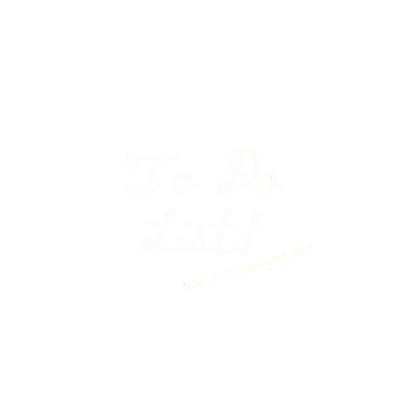

# To Do List App
Welcome to my To-Do List Project! Now introducing ads that...well add the feeling everybody loved in the 2000s of going to your favorite website and seeing they either got hacked or just really like money because geez where did all these ads come from! Most of them of course were either widely inappropriate, illegal or just weird.

We hope to recreate that feeling while also providing the functionality of your typical checklist application. Offering all the neccesities such as adding, changing, or deleting something from your list as well as recieving visual confirmation on the screen of you actuallly doing those things!

## Getting Started

Deployment Links Coming Soon!

## Attributions
Many thanks to the good people at stack overflow/exchange who's names are literally too many to mention. Thanks for making a thread six years ago about my specific issue! Also thanks to ChatGPT and Notion for helping me organize my notes. As well as twitter/x for the developers that posted Node.Js and Express tips on the platform that helped me maximize my workflow. And of course can't forget MDN, MongoDB/Atlas Documentation and Javascript.info.

## Technologies Used
1. HTML
1. CSS
1. Javascript
1. Node.js
1. MongoDB
1. Express
1. EJS 
1. Method-Override
1. Git
1. And the NPM Library as a Whole

## Next Steps

Future expansions will include a frontend CSS overhaul to make her a little prettier. As well as potentially adding more QOL features such as visual animations and quicker runtimes to maximize preformance. 

Also further down in the development cycle potentially a mobile port, via React Native.
